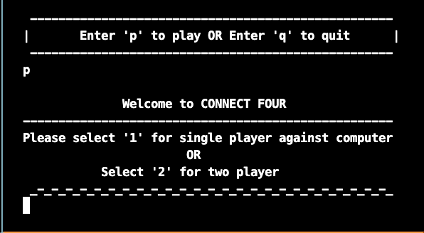
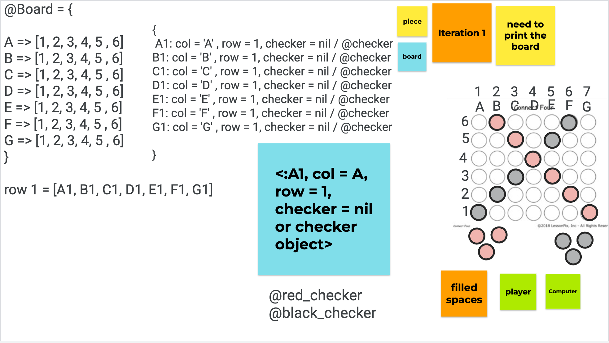
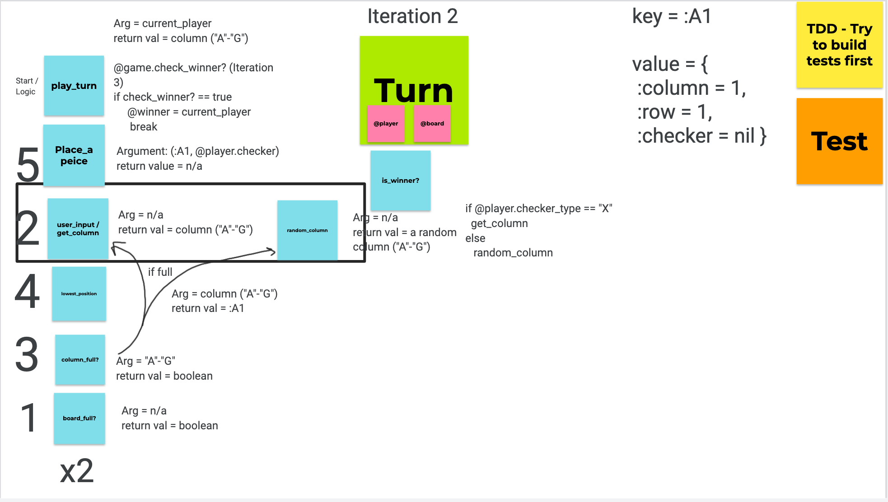
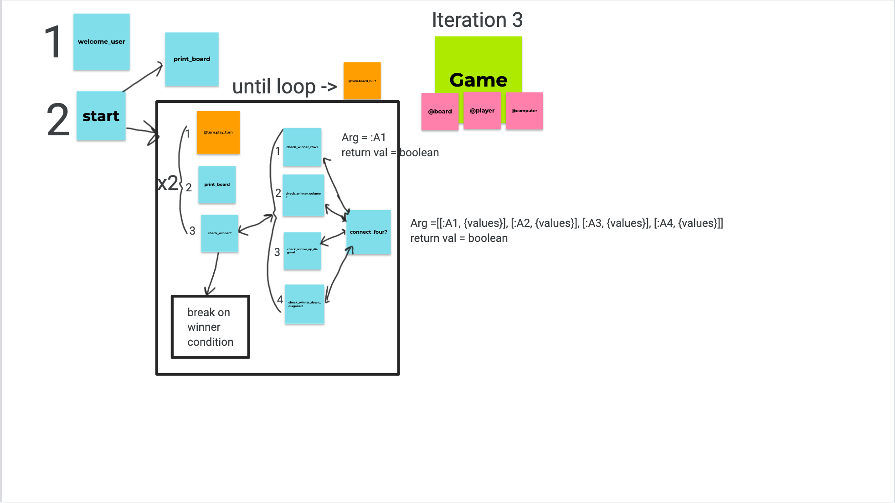

# Welcome to Connect Four!
---
## Connect Four Contributors 
This is a project made by students during Mod 1 of the Turing School of Software and Design program,
*for learning purposes only*.

A link to our video presentation of the project [here](<insert_link>)

---

## <mark>How To Play</mark>

- `git clone` [this repository](https://github.com/4D-Coder/ab-akh-connect-four-project)
- The game can be played directly within terminal (executed with `ruby runner.rb`).
- The game will then ask you to select what player you'd like to be (1. or 2.) and subsequently, you can enter your player name, and your opponent can enter theirs.
- Input your column of choice as you play by the letters indicated on the board!

## Project Checklist
---

### Iteration 1
- Classes - Game/Board
- Methods - print_board 
  
#### **Iteration 1 Planning Phase**

### Iteration 2
- Classes - Turn/Player
- Methods - play turn
  
#### **Iteration 2 Planning Phase** 

### Iteration 3
- Classes Refactor turn/game
- Methods check_winner, four winner methods, connect four method

#### **Iteration 3 Planning Phase**

### Iteration 4
 - Allows 2-Player functionality
 - Allows Customized player naming
 - **Currently gem runs only in project root directory**
   - For potential future development: Created ruby gem  universal game execution (`connect_four_ab_akh`) 
 
---

### Designed by:
- Adam Bailey [@github.com/aj-bailey](https://github.com/aj-bailey)
- Antonio King Hunt [@github.com/4D-Coder](https://github.com/4D-Coder)